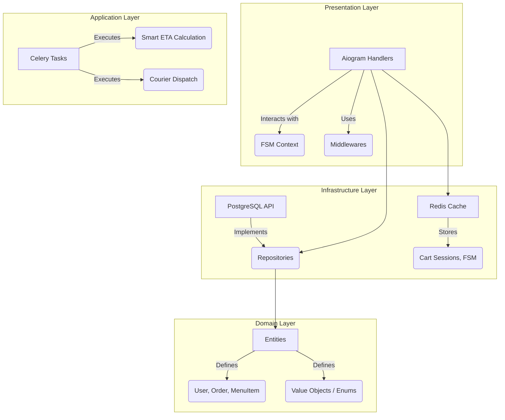
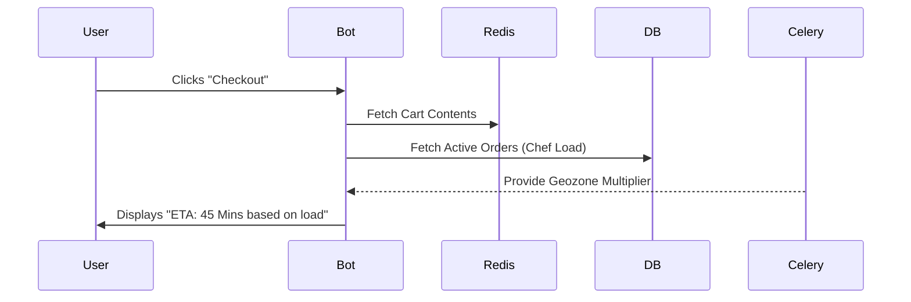
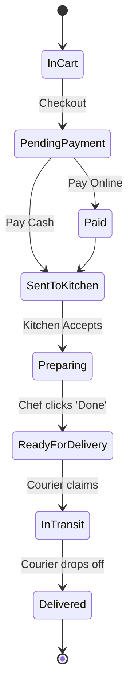

# System Architecture: NeoPizza Dark Kitchen

This document explains the technical architecture, design patterns, and entity relationships within the NeoPizza Dark Kitchen ecosystem.

## 1. Domain-Driven Design (DDD) Layers

The application is strictly divided into four distinct layers to separate concerns, improve testability, and decouple the business logic from the Telegram framework.

### 1.1 Presentation Layer
This is the boundary through which users interact with the system. It strictly handles Telegram specific objects (`Message`, `CallbackQuery`).
- **Dependency Injection**: Database connection pools (`AsyncSession`) and Redis caches are passed to handlers implicitly via Middleware to avoid dirty initialization or unclosed connections.
- **Stateless Handlers**: No state is kept in memory; everything persists to Redis, supporting horizontal scaling.

### 1.2 Application Layer
Responsible for application-specific logic like triggering background tasks.
- **Asynchronous Execution**: We map heavy operations (like checking courier geolocation distances and updating thousands of ETA metrics) onto a separate Celery pool. This ensures the Telegram Bot API loop is never blocked.

### 1.3 Domain Layer
The heart of the software. It contains enterprise business rules.
- **SQLAlchemy Models**: Placed here to map strictly to business entities (`Order`, `Restaurant`).
- **Enums**: Strict python `Enum` classes manage states (`OrderStatus`, `RoleEnum`) bridging the DB and Python cleanly.

### 1.4 Infrastructure Layer
Handles data persistence.
- **Repository Pattern**: Handlers never write `session.add(model)`. They use `OrderRepository.create()` to encapsulate the query logic.
- **Redis Sessions**: Handling cart states via atomic Redis hashes allows blazing-fast cart operations without stressing PostgreSQL.

---

## 2. Dynamic ETA Algorithm

Because Dark Kitchens deal with high latency variance during rush hours, the system avoids static delivery estimates. 

When a user opens the checkout, the system calculates:
1. `Base Prep Time` = Fixed coefficient per dish + concurrent orders in `CHEF_QUEUE`.
2. `Geozone Offset` = Radius calculation from Restaurant coordinates to User coordinates.
3. `Courier Availability` = Count of currently free couriers bounded to the zone.

## 3. Order State Machine 

The lifecycle of an order ensures money is safely gated and staff are constantly aware.

## 4. Security & Privacy Compliance

The Bot enforces a hardened security perimeter.
- **Privacy Gate**: A custom middleware intercepts *every* incoming event. If the user DB entry lacks the `accepted_privacy=True` flag, the event is swallowed, and the user is forcefully prompted with the Terms of Service.
- **Env Segregation**: All secrets (`BOT_TOKEN`, `PAYMENT_PROVIDER_TOKEN`, Database credentials) are strictly provided via Docker environment or local `.env` files. No hardcoded fallback IDs exist in production configurations.
- **Role Isolation**: The `RoleMiddleware` intercepts callbacks based on the `RoleEnum` attached to the `telegram_id` DB record, locking clients out of staff namespaces automatically.
